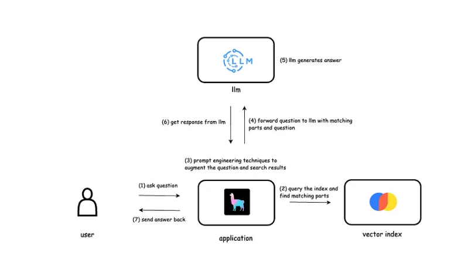
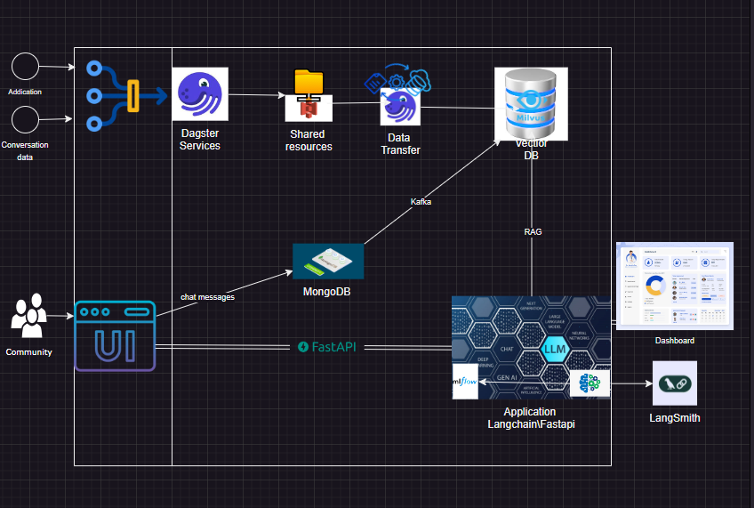
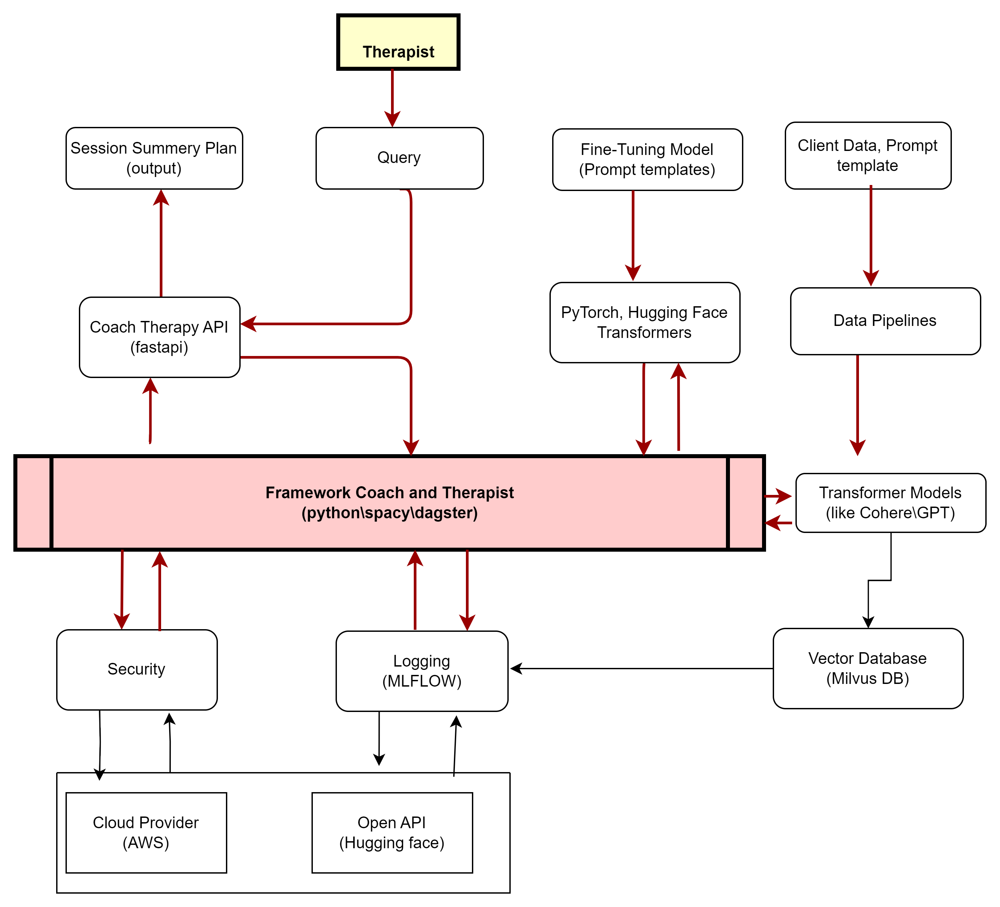

# dang.model.health
LLM by integrating Spacy, Langhian and MLflow

your_project_name/
│
├── data/                    # Directory for storing data files
│
├── models/                  # ML models (spaCy models, custom models, etc.)
│
├── notebooks/               # Jupyter notebooks for experimentation and analysis
│
├── src/                     # Source code for use in this project
│   ├── __init__.py          # Makes src a Python module
│   ├── main.py              # Main script where the project's primary functions are run
│   └── your_module/         # Custom modules for your project
│       ├── __init__.py
│       └── your_script.py
│
├── tests/                   # Test cases for your project's code
│   ├── __init__.py
│   └── test_your_module.py
│
├── .gitignore               # Specifies intentionally untracked files to ignore
├── requirements.txt         # The dependencies file for reproducing the analysis environment
└── README.md                # Top-level README for developers using this project

 Sample requirements.txt
For your requirements.txt, you would list the dependencies required for your project. Here's an example that includes spaCy, LangChain, LambIndex, and MLflow:

spacy==3.2.1
langchain=0.1.12  # Adjust to the latest version available
LlamaIndex=0.10.19   # Placeholder version, please check the correct one for LambIndex
mlflow==1.23.1
openai
ib_insync
pandas
llama-index
jinja2
streamlit

pip install llama-index

Getting Started
Here are the steps to get started with your project:

Environment Setup: Create a virtual environment for your project to manage dependencies. You can use virtualenv or conda for this:

python -m venv your_project_venv
source your_project_venv/bin/activate  # On Windows, use `your_project_venv\Scripts\activate`
Install Dependencies: Install the required libraries using pip and your requirements.txt file:

pip install -r requirements.txt
Initial Setup:

spaCy: You may need to download a language model for spaCy. For example, to download the English model:

python -m spacy download en_core_web_sm
MLflow: Start the MLflow tracking server if you're using it for experiment tracking:

mlflow ui

see the following reference

https://medium.com/rahasak/build-rag-application-using-a-llm-running-on-local-computer-with-gpt4all-and-langchain-13b4b8851db8

<!-- 

 -->

Resources:
https://positivepsychology.com/common-therapy-questions/

<!--  -->

-------------------------------------------------------------------------------------------------------------------------------------------

Managing a coaching therapy session involves several key steps to ensure that the session is effective and meets the client's needs. Here's a general overview of how a coaching therapy session might be managed:

Setting the Stage:

Preparation: Before the session, the coach may review notes from previous sessions, prepare any materials or exercises, and set a clear intention for the upcoming session.
Establishing a Comfortable Environment: Ensuring the physical or virtual space is conducive to open conversation and reflection.
Beginning the Session:

Welcoming and Grounding: A brief check-in with the client to establish rapport and make them feel comfortable.
Reviewing Agreements: Clarifying confidentiality, boundaries, and the goals of the coaching relationship.
Setting Objectives:

Identifying Focus: Discussing what the client wants to focus on during the session.
Goal Setting: Determining what the client hopes to achieve by the end of the session.
Exploration and Reflection:

Guided Dialogue: Using questions and reflective listening to explore the client's thoughts, feelings, and actions related to their goals.
Exercises and Tools: Implementing specific exercises or tools to facilitate insight, such as visualization, journaling, or role-playing.
Action Planning:

Identifying Steps Forward: Collaborating with the client to develop actionable steps they can take to move closer to their goals.
Overcoming Obstacles: Discussing potential challenges and strategizing ways to navigate them.
Closure:

Reviewing Key Insights: Summarizing the session's key points and any insights gained.
Feedback and Adjustment: Encouraging feedback from the client on the session and discussing any adjustments for future sessions.
Scheduling Follow-Up: Arranging the next session or follow-up steps, if applicable.
Post-Session Work:

Reflection and Notes: The coach may take time to reflect on the session, jot down important notes, and plan for future sessions based on the client's progress and feedback.
Professional Development: Staying informed on best practices, new methodologies, and continuous improvement to enhance coaching skills.
It's important to note that each coaching therapy session can be unique, depending on the coaching style, the client's needs, and the specific goals of the therapy. Flexibility and responsiveness to the client's needs are crucial in managing these sessions effectively.

<!-- 

 -->

promptes desing:
Creating a narrative identity in the context of coaching therapy, especially when preparing to use large language models (LLMs) like GPT for generating or augmenting such narratives, involves crafting prompts that are rich, detailed, and reflective of the individual's life experiences, challenges, aspirations, and internal conflicts. The example you provided is an excellent illustration of how detailed and nuanced these prompts can be.

To generate a prompt template for such work, you'd want to structure your prompt to cover several key areas that are common in narrative identity work. These areas can include personal background, significant life events, values and beliefs, challenges and conflicts, aspirations and dreams, and reflections on changes or growth. The goal is to provide enough detail to enable the LLM to generate meaningful, coherent, and contextually relevant narratives.

Template for Generating Narrative Identity Prompts:
Below is a template that can be adjusted or expanded based on the specific needs of your coaching therapy work or the unique aspects of the individual's story you're exploring:

vbnet
Copy code
[INTRODUCTION]
Introduce the subject by age, background, and current life situation. Mention any significant roles they play in their life (e.g., parent, professional role, community member).

[CORE CHALLENGES]
Describe the central challenges or conflicts the subject faces. These can be internal (e.g., emotional or psychological struggles) or external (e.g., circumstances or relationships).

[VALUES AND BELIEFS]
Detail the subject's key values, beliefs, and any philosophical or moral principles that guide their actions and decisions.

[LIFE EVENTS]
Highlight significant life events or turning points that have had a profound impact on the subject's identity and life path.

[ASPIRATIONS AND DREAMS]
Discuss the subject's aspirations, dreams, and what they hope to achieve or experience in the future.

[PERSONAL GROWTH AND CHANGE]
Reflect on the subject's journey of personal growth or change. Mention how they have evolved over time and any lessons learned.

[CONTEMPLATIONS AND INTERNAL CONFLICTS]
Explore the subject's internal contemplations and conflicts. This could include doubts, regrets, or areas of unresolved tension.

[CURRENT LIFESTYLE AND INTERESTS]
Describe the subject's current lifestyle, habits, and interests. Include any hobbies, passions, or routine activities that are important to them.

[RELATIONSHIP WITH THE OUTER WORLD]
Examine how the subject interacts with the broader society, including their critical thoughts on societal norms, culture, or global issues.

[PERSONAL ANECDOTES OR QUOTES]
Include any personal anecdotes or quotes that encapsulate the subject's perspective or experiences.

[CONCLUSION]
Conclude with a summary of the subject's current state, ongoing questions, or dilemmas they are facing, and what they are seeking or moving towards in their life journey.
Sample Prompt Based on the Template:
"Introduce a 35-year-old software engineer living in San Francisco, a devoted environmental activist, and an aspiring writer. They struggle with the balance between their demanding career and their passion for environmental activism. Raised in a family that valued hard work and perseverance, they've always sought to make a meaningful impact on the world. Significant life events include a transformative trip to the Amazon rainforest and the recent loss of a close friend, which have profoundly shaped their worldview and priorities. They dream of publishing a novel that combines their love for technology and environmental advocacy. Despite career success, they grapple with questions of fulfillment and the direction of their personal and professional life. They are an avid reader, particularly interested in works by Carl Sagan and Rachel Carson, reflecting a deep curiosity about the cosmos and environmental conservation. Their narrative is one of seeking harmony between their inner values and outer actions, aspiring to lead a life that is true to themselves and beneficial to the planet."

This prompt structure and example can help guide the generation of rich, detailed narratives using LLMs for individuals in coaching therapy, facilitating exploration, and understanding of their narrative identities.

User
how to use this in LLM template 
ChatGPT
To utilize the narrative identity template in the context of a large language model (LLM) like GPT-3 or similar, you'll need to adapt the template to create prompts that are clear, specific, and aligned with what you want the LLM to generate. Here's how you can approach this, including constructing the prompt, calling the LLM, and interpreting its output for therapeutic or coaching purposes.

Step 1: Constructing the Prompt
Based on the narrative identity template provided earlier, construct a detailed prompt that includes the background, challenges, aspirations, and other relevant aspects of the individual's story. Ensure the prompt is specific enough to guide the model towards generating the type of narrative you're interested in.

Here's a simplified example prompt based on the template:

css
Copy code
"Generate a narrative identity for a person who is a 35-year-old software engineer living in San Francisco, deeply passionate about environmental activism and aspiring to be a writer. They face challenges balancing their demanding tech job with their activism. They were profoundly influenced by a trip to the Amazon rainforest and the loss of a close friend, pushing them towards seeking meaning and impact through their actions and writing. They dream of writing a novel that bridges their tech expertise with environmental concerns. Despite professional success, they contemplate fulfillment, personal growth, and the alignment between their actions and values. They are inspired by thinkers like Carl Sagan and Rachel Carson, reflecting their curiosity about the environment and the universe. Their story is one of navigating the complexities of modern life while striving to remain true to deeply held values and making a difference in the world."
Step 2: Using the Prompt with an LLM
To use this prompt with an LLM, you'll typically interact with the model through an API or a programming library that allows you to send the prompt and receive the generated text. Here's an example using OpenAI's GPT-3 with the openai Python library. First, ensure you have the library installed:

bash
Copy code
pip install openai
Then, you can use the following Python code to send the prompt to GPT-3 and print the model's output:

python
Copy code
import openai

openai.api_key = 'your_api_key_here'

response = openai.Completion.create(
  engine="text-davinci-003", # Or the latest available model
  prompt="Generate a narrative identity for a person who is a 35-year-old software engineer living in San Francisco...",
  max_tokens=500,
  temperature=0.7,
  top_p=1,
  frequency_penalty=0,
  presence_penalty=0
)

print(response.choices[0].text.strip())
Step 3: Interpreting the Output
Once you receive the generated narrative from the LLM, the next step is to interpret and possibly refine it for therapeutic or coaching purposes. This process might involve:

Reflecting on the narrative's themes and insights: Discuss the generated narrative with the individual (if applicable) to explore its relevance, accuracy, and any insights it might offer into their identity, challenges, and aspirations.
Revising the narrative: Based on reflection and discussion, you might revise the narrative or prompt the LLM to generate alternative narratives or explore different aspects of the person's story.
Using the narrative as a therapeutic tool: The narrative can be used as a starting point for deeper exploration in therapy or coaching sessions, helping individuals understand their identity, resolve conflicts, and make meaningful life changes.
This approach leverages the power of LLMs to generate rich, detailed narratives that can support therapeutic and coaching processes, offering new perspectives and insights into individuals' narrative identities.

